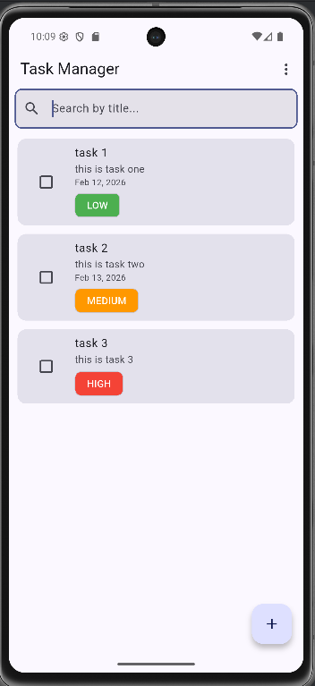
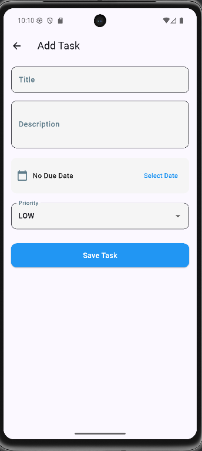

# Offline-First Task Manager App

This is a Flutter mobile application built as part of a take-home assignment.  
The application allows users to manage tasks with full offline support while demonstrating clean architecture, proper state management, and structured code organization.

## Objective

The goal of this project is to demonstrate:

- Clean Architecture principles
- Proper separation of concerns (Data, Domain, Presentation)
- Offline-first functionality using local storage
- Structured state management using BLoC
- Clean, maintainable, and scalable code

## Features

### Task Management

- Create tasks
- Edit tasks
- Delete tasks
- Mark tasks as completed

Each task includes:

- Title (required)
- Description (optional)
- Due date (optional)
- Priority (Low / Medium / High)
- Completion status

### Offline Support

- All tasks are stored locally on the device
- Data persists between app launches
- Local storage implemented using Hive

### Filtering

- View All tasks
- View Completed tasks
- View Pending tasks

### UI / UX

- Task list screen with visual priority indicators
- Checkbox/toggle for completion
- Add/Edit task screen with form validation (title required)
- Proper empty state when no tasks exist
- Subtle animation for task insertion/removal

### Additional Enhancements

- Search tasks by title
- Swipe to delete with Undo (SnackBar)

## Architecture

The project follows Clean Architecture principles to ensure scalability, maintainability, and testability.

### Layer Responsibilities

Presentation Layer
- UI Screens and Widgets
- BLoC state management
- Handles events and rebuilds UI based on states
- Contains no direct database logic

Domain Layer
- Business rules
- Entities
- Repository interfaces
- Use cases
- Pure Dart (independent of Flutter and database)

Data Layer
- Repository implementation
- Local data source (Hive)
- Model ↔ Entity conversion

### Data Flow

User Action  
→ BLoC Event  
→ UseCase  
→ Repository  
→ Local Data Source (Hive)  
→ State Emitted  
→ UI Updated

## State Management

The application uses the BLoC (Business Logic Component) pattern:

- UI triggers events
- BLoC processes business logic
- States are emitted
- UI rebuilds accordingly

Proper loading, empty, and error states are handled.

## Setup Instructions

Clone the repository:

```bash
git clone https://github.com/your-username/task-manager-app.git
cd task-manager-app
```

Install dependencies:

```bash
flutter pub get
```

Run the app:

```bash
flutter run
```

## Architectural Decisions

- Clean Architecture was chosen to improve scalability and maintainability.
- Hive was selected for lightweight and efficient local storage.
- BLoC was used to ensure clear separation between UI and business logic.
- Repository pattern was implemented to allow easy replacement of data sources in the future.

## Trade-offs

- No backend or cloud synchronization implemented.
- No authentication or user accounts.
- Focused on core requirements rather than feature expansion.
- No automated testing included in this version.

## Screenshots




